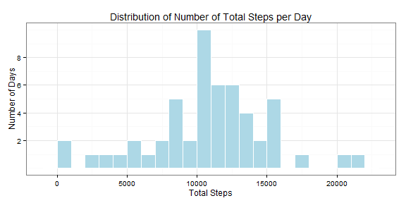
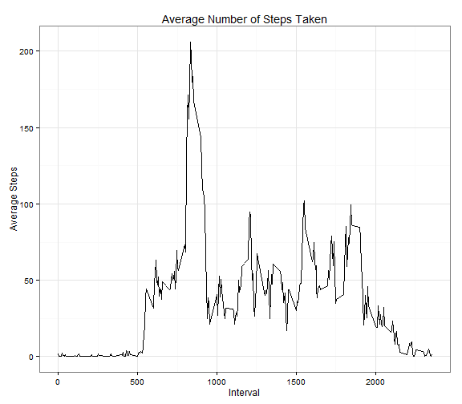
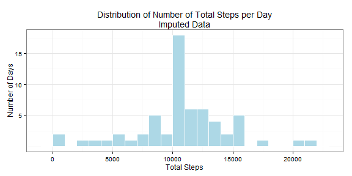
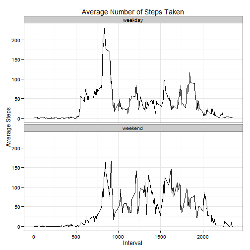

## Loading and preprocessing the data
The data is loaded from the working directory, stored in a csv file called "activity.csv"
The following code loads necessary libraries and reads in the data:

```r
require(plyr,quietly=TRUE)
```

```
## Warning: package 'plyr' was built under R version 3.1.1
```

```r
require(dplyr,quietly=TRUE)
```

```
## Warning: package 'dplyr' was built under R version 3.1.1
```

```
## 
## Attaching package: 'dplyr'
## 
## The following objects are masked from 'package:plyr':
## 
##     arrange, desc, failwith, id, mutate, summarise, summarize
## 
## The following objects are masked from 'package:stats':
## 
##     filter, lag
## 
## The following objects are masked from 'package:base':
## 
##     intersect, setdiff, setequal, union
```

```r
require(tidyr,quietly=TRUE)
```

```
## Warning: package 'tidyr' was built under R version 3.1.1
```

```r
require(ggplot2,quietly=TRUE)
```

```
## Warning: package 'ggplot2' was built under R version 3.1.1
```

```r
require(xtable,quietly=TRUE)
```

```
## Warning: package 'xtable' was built under R version 3.1.2
```

```r
file_name <- "activity.csv"
activity_data <- read.csv(file_name,colClasses=c("integer","character","integer"),stringsAsFactors=FALSE)
activity_data$date <- as.Date(activity_data$date)
```

The data contain the following variables:
steps, date, interval

and have 3 observations.


## What is mean total number of steps taken per day?
For this the data has to be summarised by day, and then the mean ascertained.  Days with no data are removed.
**I use dplyr, tidyr for data manipulation and ggplot2 for plotting.**  

1. Make a histogram of the total number of steps taken each day

```r
steps_sum <- activity_data %>% group_by(date) %>% summarise(total_steps=sum(steps))
gp <- ggplot(steps_sum,aes(x=total_steps)) + theme_bw()
gp <- gp + geom_histogram(binwidth=1000,fill="lightblue",color="white") + scale_y_continuous(breaks=c(2,4,6,8))
gp <- gp + ggtitle("Distribution of Number of Total Steps per Day") + xlab("Total Steps") + ylab("Number of Days")
print(gp)
```

 

2. Calculate and report the **mean** and **median** total number of steps taken per day

```r
mean_steps <- mean(steps_sum$total_steps,na.rm=TRUE)
median_steps <- median(steps_sum$total_steps,na.rm=TRUE)
```

The mean total number of steps taken per day is: 10,766.

The median total number of steps taken per day is: 10,765.


## What is the average daily activity pattern?
1. Make a time series plot (i.e. `type = "l"`) of the 5-minute interval (x-axis) and the average number of steps taken, averaged across all days (y-axis)


```r
avg_steps <- activity_data %>% group_by(interval) %>% summarise(average_steps = mean(steps,na.rm=TRUE))
max_interval <- avg_steps[which(avg_steps$average_steps==max(avg_steps$average_steps)),"interval"]
names(avg_steps) <- c("interval","average_steps")
gp <- ggplot(avg_steps,aes(x=interval,y=average_steps)) + theme_bw()
gp <- gp + geom_line() + ggtitle("Average Number of Steps Taken") + xlab("Interval") + ylab("Average Steps")
print(gp)
```

 

2. Which 5-minute interval, on average across all the days in the dataset, contains the maximum number of steps?

The 5-minute interval is interval 835.


## Imputing missing values
1. Calculate and report the total number of missing values in the dataset (i.e. the total number of rows with `NA`s)


```r
missing_data <- activity_data[is.na(activity_data$steps),]
missing_days <- as.data.frame(t(table(missing_data$date)))
missing_days <- missing_days[,c(2,3)]
names(missing_days) <- c("date","nobs")
```
There are 2304 rows with missing data.  
There are 8 days of missing data.

2. Devise a strategy for filling in all of the missing values in the dataset. The strategy does not need to be sophisticated. For example, you could use the mean/median for that day, or the mean for that 5-minute interval, etc.
The strategy used to impute missing values is to put in the mean for the 5-minute interval.

3. Create a new dataset that is equal to the original dataset but with the missing data filled in.

```r
# Calculate the average for each five minute interval
avg_steps <- activity_data %>% group_by(interval) %>% summarise(average_steps = mean(steps,na.rm=TRUE))
# Save the index for the missing values
missing_index <- which(is.na(activity_data$steps))
missing_data <- activity_data[missing_index,]
# Include the index in the missing data frame, in order to insert back the value in the right location
missing_data$index <- missing_index
imputed_data <- activity_data
temp <- merge(missing_data[,c("date","interval","index")],avg_steps,by="interval")
imputed_data$steps[temp$index] <- temp$average_steps
```

4. Make a histogram of the total number of steps taken each day and Calculate and report the **mean** and **median** total number of steps taken per day. Do these values differ from the estimates from the first part of the assignment? What is the impact of imputing missing data on the estimates of the total daily number of steps?


```r
steps_sum2 <- imputed_data %>% group_by(date) %>% summarise(total_steps=sum(steps))
gp <- ggplot(steps_sum2,aes(x=total_steps)) + theme_bw()
gp <- gp + geom_histogram(binwidth=1000,fill="lightblue",color="white") + scale_y_continuous(breaks=c(5,10,15,20))
gp <- gp + ggtitle("Distribution of Number of Total Steps per Day\nImputed Data") + xlab("Total Steps") + ylab("Number of Days")
print(gp)
```

 

Histogram of total number of steps taken each day.


```r
mean_steps2 <- mean(steps_sum2$total_steps,na.rm=TRUE)
median_steps2 <- median(steps_sum2$total_steps,na.rm=TRUE)
```

The mean total number of steps taken per day (imputed data) is: 10,766.  
The median total number of steps taken per day (imputed data) is: 10,766.

The mean number of total steps per day does not differ, since the mean value per interval has been used to impute the missing data.
The median value shows a change, from 10765 to 10766, since that is now the most common value due to imputation, using the mean of each interval.

## Are there differences in activity patterns between weekdays and weekends?
1. Create a new factor variable in the dataset with two levels -- "weekday" and "weekend" indicating whether a given date is a weekday or weekend day.

1. Make a panel plot containing a time series plot (i.e. `type = "l"`) of the 5-minute interval (x-axis) and the average number of steps taken, averaged across all weekday days or weekend days (y-axis).


```r
# Get the weekday number (1=Monday, etc.) from the date, and create a factor variable "dayofweek"
# indicating whether it is a "weekday" or "weekend" day
day_number <- strftime(imputed_data$date,format="%u")
imputed_data$day_number <- day_number
imputed_data$dayofweek <- ifelse(day_number=="6" | day_number=="7","weekend","weekday")

# Function that calculates the average number of steps per interval across all days
average_steps <- function(data) {
    avg_steps <- data %>% group_by(interval) %>% summarise(average_steps = mean(steps,na.rm=TRUE))
}

# Split the data by "weekday" and "weekend" and apply the function above, to calculate average
# steps across the days
weekday_steps <- ddply(imputed_data,.(dayofweek),average_steps)

gp <- ggplot(weekday_steps,aes(x=interval,y=average_steps)) + facet_wrap(~dayofweek,nrow=2) + theme_bw()
gp <- gp + geom_line() + ggtitle("Average Number of Steps Taken") + xlab("Interval") + ylab("Average Steps")
print(gp)
```

 

Average number of steps taken during an interval, by weekday and weekend.
